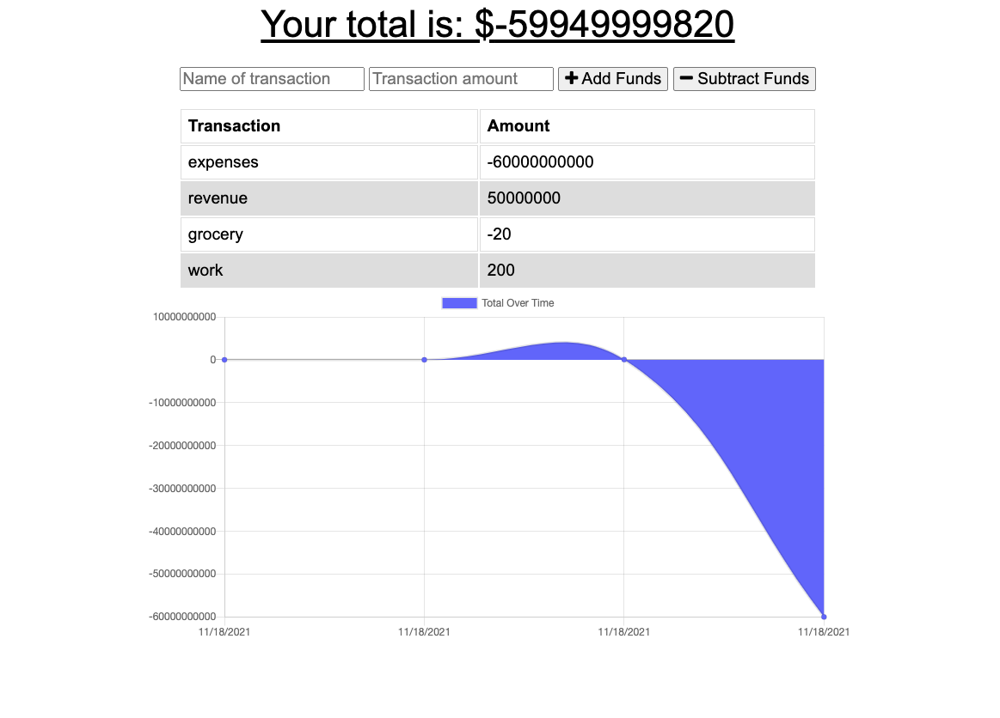

# Offline-budget-tracker
Budget Tracking app that can be used online or offline.  This app is also a Progressive Web Application (PWA) which allows user's to download it to their device. The user will be able to add expenses and deposits to their budget with or without a connection. When entering transactions offline, they are able to populate the total when brought back online. 

## Getting Started
1. Install express
2. Install if-env
3. Install Mongoose
4. Install Morgan
5. Install life-server

## Usage 
1. generate database with "npm start"
 2. (note: if link hasn't been visited in a while it may take a minute for Heroku to launch the website)

## Mock Up

## Built With

* [JavaScript]
* [Nodejs]
* [HTML] 
* [CSS]
* [Express]
* [MongoDB]
* [Mongoose]
* [Morgan]
* [Chart.js]
* [Web-Manfests]
* [Service-workers]

## Deployed Link

* [See Github Site](#) https://github.com/umeramalek/workout-tracker
* [See Live Site](#) https://powerful-eyrie-62782.herokuapp.com/ 

## Authors

* **UMERA MALEK** 

- [Link to Portfolio Site](https://umeramalek.github.io/umeramalek-portfolio-3/)
- [Link to Github](https://github.com/umeramalek)
- [Link to LinkedIn](www.linkedin.com/in/umeramalek)

